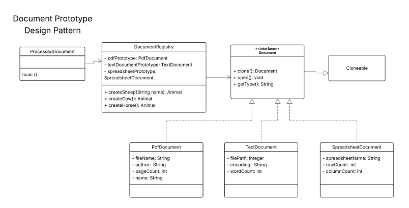

# Document Prototype Design Pattern

A Java implementation of the **Prototype Design Pattern** for creating and managing different types of documents (PDF, Text, and Spreadsheet) efficiently through cloning.

This project demonstrates how to use prototypes to avoid the cost of repeatedly creating new objects from scratch, following the structure shown in the original UML diagram.

## 📋 Table of Contents
- [Overview](#overview)
- [Design Pattern Used](#design-pattern-used)
- [Class Structure](#class-structure)
- [Features](#features)
- [How to Run](#how-to-run)
- [Sample Output](#sample-output)
- [UML Diagram](#uml-diagram)

## Overview

This application simulates a document processing system where different document types are created using **prototypes**. The `DocumentRegistry` holds prototype instances and provides factory methods to clone and configure new documents.

It closely follows the same logic and coding style as the provided `Animal` / `AnimalRegistry` example.

## Design Pattern Used

**Prototype Pattern** (Creational)

- Defines an interface for cloning objects (`Document` interface with `clone()` method).
- Concrete classes (`PdfDocument`, `TextDocument`, `SpreadsheetDocument`) implement the cloning behavior.
- `DocumentRegistry` acts as a prototype registry, creating and managing prototype instances in its constructor.

## Class Structure

- **`Document`** – Interface (extends cloning capability)
- **`PdfDocument`**, **`TextDocument`**, **`SpreadsheetDocument`** – Concrete prototype classes
- **`DocumentRegistry`** – Holds prototypes and provides creation methods
- **`ProcessedDocument`** – Client class containing the `main()` method

## Features

- Efficient object creation via cloning
- Centralized prototype management
- Easy extension for new document types
- Proper encapsulation with getters and setters
- Clean output matching the required format

## UML Diagram

